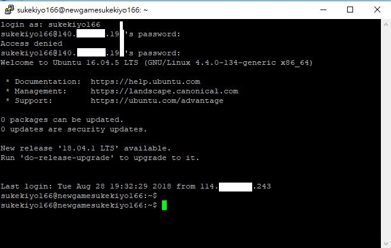

# NewbieVillage

這邊是一個給有興趣入門資訊人的基礎學習指引，目標是從僅具備基本電腦常識，進階到可以獨力完成Web應用。

我不求你可以成為高手，所以課程中各重點我只要求你學到「能用即可」。資訊是工具，協助你解決問題，代替你處理瑣事，讓你擁有 **「讓事情發生」** 的能力。當你了解了這個生態系，知道問題該上哪去找答案，剩下的成長就是你自己的事了。

我的身份是一個引導者，告訴你有哪些關卡要過，通關條件是什麼，有哪些資源可以收集，幫你鑑定什麼是有用的，什麼你可以跳過。我不會開課教你，也不會幫你收集資料，要離開新手村，得要你自己動手。

期待資訊能為你所用，成為你的力量

## 離開新手村的條件

* 一份看起來還不錯的線上履歷（或者該說是，自我介紹）
* 一份獨力完成的Web專案
  * 開放原始碼，並選定一個License
  * 提供線上服務
  * 這個專案至少幫到一個人，那個人最好是你

為了達成這件事，你至少需要...

## 技能樹

* 網站前端技能
  * 三大頭
    * HTML5 - 描述一個頁面上有哪些物件
    * CSS - 描述一個物件該有的色彩與外型
    * JavaScript - 描述頁面該怎麼跟使用者互動
  * 基本框架與套件
    * Bootstrap - 協助你快速產生一個還算漂亮的網頁
    * jQuery - 協助你更簡單的使用JavaScript
* 網站後端技能
  * Ruby - 一個快速開發的語言，與電腦溝通的方式
  * Rails - 幫你把伺服器所有的東西都寫好，方便你引用完成自己的網站
  * 資料庫操作 - 一個方便你儲存資料的地方
* Linux操作技能 - 網站總是要有個地方放，在你誤入Windows陷阱而崩潰之前，先拉你來Linux
* 網路基本技能 - 為什麼網站無法顯示？在你急急忙忙打電話之前，先試試這個
* 使用協作工具
  * git 方便你管理程式碼，寫壞了隨時可以回溯，在多人合作時不用打架

### FAQ

*Q: 好多程式語言要學 QAQ*

* 是的，不過不要被這個嚇到了。學習語言最困難的地方在理解對方的思路，也就是理解電腦的思路。一旦你了解一個語言，其他的很快都可以take起來。很多人學第一個語言要花一年，第二個三個月就好，第三個可能一邊Google一邊就開始寫了。現在我能使用的語言大概有十來種。
* 我學會的第一個語言就是copy別人的範例來改，也就這樣而已，多寫就上手了。
* 所有語言都一樣，用了才會，大量寫就對了。
* 別背單字（語法），尤其是可以查Google的時候

*Q: 為什麼選擇RoR與Bootstrap？*

* “快速開發”、“可獨力完成”、“薪水高且搶手”這三大優勢。他不是最好的語言，不過只有你的開發速度越快，累積的經驗越多，你才能越早走上正軌
* 一個好的開發者不會只用一種語言。語言與框架不過是工具，在不同的情境下使用不同的工具是一個熟練開發者的基本。

*Q: 好多英文 QAQ*

* 請大家做好心理準備的是，資訊毫無疑問是一個英文為主要溝通語言的世界。絕大多數資料你都會需要上英文網站去查詢，而中文在很多指令與程式中很容易給你帶來意料之外的麻煩。
* 幸好的是，科技類英文比起一般英文簡單好用很多，只要願意看，可以很快地累積成就感～

## 資源列表

**正式課程**

* 六角學院線上課程 <http://www.hexschool.com/courses>
  * 先 HTML/CSS + jQuery
  * 然後 Bootstrap4 + JavaScript
* 五倍紅寶石實體課程 <https://5xruby.tw/talks>
* 五倍紅寶石線上課程 <https://backerfounder.typeform.com/to/SgY7kv>

**免費資源**

* [Git入門](https://backlog.com/git-tutorial/tw/) 可能有點硬，實際上你們用到的應該沒這麼多
* [鳥哥的linux](http://linux.vbird.org/linux_basic/) 也有點硬，我找找有沒有書...不過這是很棒的一個網站，我剛學的時候都上來查資料，所以有餘力都讀過會很有幫助
* 前端
  * [JavaScript小遊戲: 程式碼RPG](https://codecombat.com/play)
  * [CSS小遊戲: 找到你的午餐](https://flukeout.github.io/) 等CSS念到一半就可以來玩，很可愛的小遊戲，請以玩到通關為目標
  * [CSS小遊戲: FLEXBOX FROGGY](https://flexboxfroggy.com/)
  * [CSS小遊戲: GRID GARDEN](http://cssgridgarden.com/)
  * [W3School線上課程 啥都有](http://www.w3school.com.cn)
  * [JavaScript線上教學](https://www.codecademy.com/learn/introduction-to-javascript)

**書籍**

* [為你自己學GIT](https://gitbook.tw/)
  * 章節1-6
  * 章節10 遠端共同協作
* [跟阿銘學Linux](https://www.kingstone.com.tw/book/book_page.asp?kmcode=2014713560278&Actid=tornado)
  * 章節1 學習之初
  * 章節3 遠端登入Linux系統
  * 章節4 Linux檔案與目錄管理
  * 章節5 Linux使用者管理
  * 章節6.1 查看磁碟或目錄的容量
  * 章節7 VIM文字編輯器
  * 章節8 檔案壓縮與打包
  * 章節9 安裝RPM套件
  * 章節10 shell基本認識
  * 選修
    * 章節2 安裝CentOS
    * 章節12 Shell Script
    * 章節13 Linux系統管理技巧
    * 章節14 LAMP
    * 章節16 MySQL操作
* [為你自己學 Ruby on Rails](https://railsbook.tw/)
  * 章節 1-22
  * 章節 27-32
* 前端書籍待補

## 讀書會

有碰面就有激勵，所以來約個實體讀書會吧

* 週期：每週一次 
* 當前週期的書：
* 每週挑戰：

最主要的任務是：跟大家分享一下這週你讀了些什麼，做了些什麼，哪些特別引起你的注意（或踩了什麼雷），以及接下來預定要讀些什麼

如果當日有事無法現場到，也可以先把想分享的內容打好貼到這邊

要特別留意的是：請平常就找時間看書，讀書會不是給你現場抱佛腳用的。當然分享完可以現場念沒關係，但別忘了唸書的時間以及實作範例的時間都不是短短的讀書會時間可以讓你補完的

## 任務列表

### 新手任務Lv.0

* 擁有一個Github帳號，這裡會是你公開程式碼與成果的地方
  * <https://github.com/>
  * <http://blog.kevinlinul.idv.tw/?p=369>
  * **檢查點：請把你的Github帳號的網址傳給我**
* 登入練習機（Linux Ubuntu 16.04）
  * 練習機資訊我已經個別私訊給各位
  * **檢查點：請把你第一次登入成功的畫面截圖給我**
* 認識環境：編輯器
  * 安裝[sublime text 3](https://www.sublimetext.com/3)
  * [sublime text 3課程](https://www.udemy.com/sublime-text-3/)
  * 或你可以[選擇別的](http://rubyer.me/blog/84/)如 [Notepad++](https://notepad-plus-plus.org/zh/) / [Rubymine](https://www.jetbrains.com/ruby/) / [NetBeans](https://netbeans.org/) / [Eclipse](https://www.eclipse.org/) / [Aptana Studio](http://www.aptana.com/) 甚至筆記本，教學自己Google
  * **檢查點：請把編輯器打開的畫面截圖給我**
* 排定唸書的時間
  * 一週至少四小時實體讀書會，分享學習心得
  * 一週唸書的時間至少8hr
  * 請主動於群組回報並敲定時間
  * **檢查點：請個別回報讀書規劃給我**

關於Github

* Github是一個讓大家放自己的專案的地方，給大家看一下我的 <https://github.com/sakura26>
  * 首頁以可以看到我做了哪些專案，你可以看到我有哪些專案是大家有興趣的。特別的地方是，你可以看到有星星跟分岔的符號後面跟著數字，星星代表有多少人喜歡你的專案，而分岔代表有人覺得這份專案很棒，建立了一份分枝來改成自己的版本
  * 而下方則是我在這一年內的所有活動，例如修改程式碼、提供貢獻給其他專案等等，高活躍度的人很容易就看得出來
* 至於一個常見的專案長什麼樣？這是我在Github上的第一個專案，[自爆按鈕（？）](https://github.com/sakura26/killallbtn)
  * 在上方有一個狀態列，紀錄了這個專案經歷了六次修改（commits），一個分支（branch），一個開發者（contributor），以及使用哪一種授權公開（這邊用的是BSD授權）
  * 檔案右邊你可以看到最後修改時間、最後修改的意見、點進檔案就可以看到內容
* 他不只可以用來公開你的專案原始碼，我也常常把它拿來當blog寫 [我的釀酒部落格](https://github.com/sakura26/ethanol)
  * 既然要把他當blog寫，總是會想貼點圖或寫得文情並茂一點，這個時候請參考這邊
Github支援顯示的語法有好幾種，但最主要也最好用的叫做Markdown
[語法](https://guides.github.com/features/mastering-markdown/)
  * Markdown的副檔名是 .md 
他是一種，就算你沒有專屬編輯器，打開檔案看起來也會很舒服的一種檔案格式
例如這是我[8/6的釀酒紀錄](https://github.com/sakura26/ethanol/blob/master/brewingHistory/180806-ethen-belgianpaleale.md
)，[原始碼長這樣](https://raw.githubusercontent.com/sakura26/ethanol/master/brewingHistory/180806-ethen-belgianpaleale.md)
  * MD的設計概念就是文字為本體，用人看得懂的方式略為修飾就好。也有線上編輯器，可以一邊打就直接看到出來的結果長怎樣。例如這是我正在學[GoLang的筆記](https://hackmd.io/5RTwaiTSSNqblbNSTqvxmA?both)
* 同時你也可以用它架設你的網站（只限靜態頁面），因此很適合作為純前端展示之用。這是我幫TDOH做的技能樹的網站，實際上就是由Github提供服務的 [駭客學習地圖](http://map.tdohacker.org/) ＝ [原始碼](https://github.com/tdoh/map) 

關於第一次登入Linux主機

* 請使用ssh連線上去，他沒有視窗沒有桌面，完全是指令行
* 登入的方式請參考[這篇](https://ph302.cs.pu.edu.tw/putty.htm)
* 請從這邊下載[putty](https://the.earth.li/~sgtatham/putty/latest/w64/putty.exe)

* 這個畫面代表你成功登入了這台主機，這是這台主機給你的歡迎畫面，一些簡介，而最後一行代表機器在等待你輸入指令
* <你的帳號>@<這台主機名稱>:<你現在的目錄>$ 
* 你現在的身份是一般使用者，所以結尾是$，如果是特權帳號，結尾則是#
* 以這個例子來說，帳號是sukekiyo166，主機名稱是newgamesukekiyo166，你現在的目錄是~，代表你的家目錄的縮寫，實際上完整路徑是 /home/sukekiyo166
* 你現在只需要確認你可以連上去就好，接下來開始學linux基礎的時候，所有的練習都在這上面進行，同時接下來學RoR的時候，架設伺服器也會使用這一台。
* 你可以任意使用它，搞壞了跟我說，我幫你做系統還原（不過所有你在上面的資料也都會消失）

### 新手任務Lv.1

待定

##### TODO

前端路線

* 以純HTML完成第一個網頁 HelloWorld
* 暨第一個作業，加入CSS來設定色彩、背景、框線與滿版
* 使用BootStrap把上面的改寫成更漂亮的網頁
* 使用jQuery，點擊按鈕後會問出生日，並計算年齡後顯示於網頁

後端路線

* 完成第一個Ruby程式，在命令行顯示 HelloWorld
* 同上，改成網站顯示
* 寫一個應用，接收網頁輸入的出生日，回應年齡
* 同上，會記錄登入者的出生日，下次對方回來時如果未滿18，會跳出警告並導向到迪士尼（？

總和測試: 挑一個黑客松來玩？