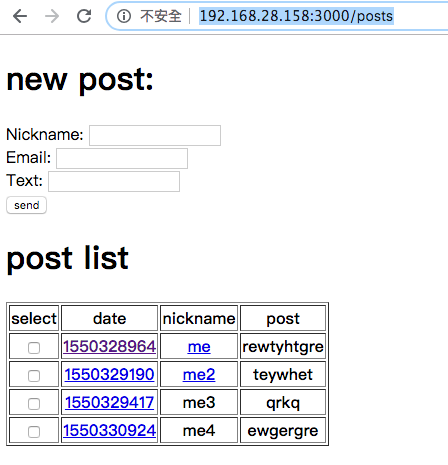

# 讀書會主題:簡易留言板

範例專案msgboard: <https://github.com/sakura26/NewbieVillage/tree/master/msgboard>



請大家將此範例專案下載後安裝執行起來，試著玩玩看，然後看一下幾個關鍵的檔案如route/controller/view，下次聚會我會請大家分別解釋裡面的程式碼，隨機問，所以一定要讀喔

如果裝不起來或任何問題，請跟我確認，請不要讀書會當天才問我（笑

```
溫馨提示
# bundle install   安裝相對應套件
# rails server    執行rails

參考文件
https://railsbook.tw/chapters/10-mvc.html
https://railsbook.tw/chapters/11-routes.html
https://railsbook.tw/chapters/12-controllers.html
```

## 作業

* 請試閱讀 /msgboard/config/routes.rb 、 /msgboard/app/controllers 、 /msgboard/app/views 並解釋其意義
* 請加入單筆刪除功能
* 請完成多重刪除功能